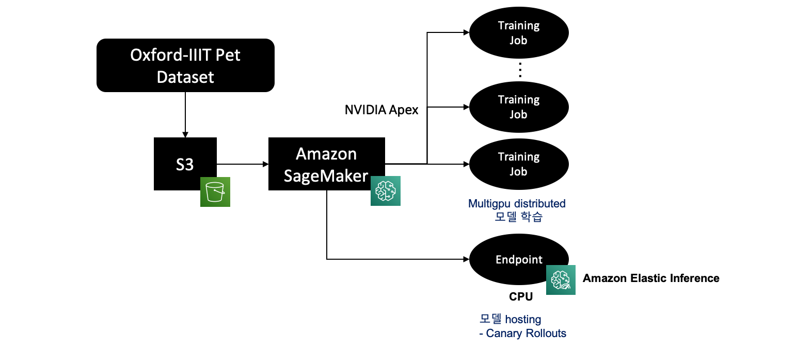

# AI-ML workshop on AWS

## 1. CloudFormation을 활용한 AWS Resource 생성

이 워크샵에 필요한 AWS 리소스를 생성하기 위해 CloudFormation 스택을 제공합니다.\
CloudFormation 스택은 실습환경으로 사용할 SageMaker 노트북 인스턴스를 생성하게 되며, 실습에 활용할 서비스을 실행하는 policy가 포함된 Role을 함께 생성하게 됩니다.\
아래 링크를 선택하면 스택이 시작될 AWS 콘솔의 CloudFormation 으로 자동 redirection됩니다.

* [Launch CloudFormation stack (N.Virginia)](https://console.aws.amazon.com/cloudformation/home?region=us-east-1#/stacks/create/review?stackName=AIMLWorkshop&templateURL=https://napkin-share.s3.ap-northeast-2.amazonaws.com/cloudformation/sagemaker-hol.yml)


CloudFormation 스택은 최소한 다음 리소스를 만듭니다.

* Jupyter 노트북에서 모델을 정의하는 SageMaker 노트북 인스턴스. 모델 자체는 AWS SageMaker 서비스를 사용하여 학습됩니다.
* AWS 리소스에 액세스하는 데 필요한 IAM 역할

AWS CloudFormation 콘솔의 Quick create stack 페이지로 리디렉션 된 후 다음 단계를 수행하여 스택을 시작하십시오.

* Intial 에서 자신의 영문 initial 또는 unique한 영문글자를 넣어주시기 바랍니다.
* Capabilities 에서 ***I acknowledge that AWS CloudFormation might create IAM resources***을을 체크합니다.
* Create stack 버튼을 누르고, stack 생성이 완료될 때까지 기다립니다. 10분 정도 소요됩니다.


CloudFormation 콘솔의 스택에 대한 ***Output*** 섹션에서 생성 된 리소스에 대한 정보를 찾을 수 있습니다. 언제든지 ***Output*** 섹션으로 돌아와서 값을 확인할 수 있습니다.


***Output*** 섹션에서 링크를 클릭하시면 SageMaker Notebook으로 접근이 가능하시며, 실습한 코드를 사전에 준비하였습니다.

지금까지 환경설정이 완료되었고 다음 장부터 Training과 Inference를 위한 실습이 진행됩니다.


##  2. SageMaker 사전 학습
```0.ML_Fundamentals_with_SageMaker``` 실습은 Mnist 데이터를 이용하여 간단하게 SageMaker 에서 Training과 Inference 하는 실습을 진행합니다.
SageMaker의 Built-in Algorithm으로 학습하는 방법과 모델 학습 코드가 있는 경우 SageMaker에서 학습하는 방법에 대해 실행해 보도록 합니다.


## 3. Training Model for Tabular dataset 

### 1. 실습 구성
이번 실습에서는 아래 단계를 걸쳐서 진행을 할 예정입니다.


### 2. 실습 시 사용되는 AWS 서비스 이해

**Amazon Simple Storage Service (Amazon S3)** : 확장성과 데이터 가용성 및 우수한 보안, 성능을 제공하는 object storage  \
**Amazon Athena** : S3 데이터를 interactive한 표준 SQL 쿼리가 가능한 서비스  \
**AWS Data Wrangler** : 다양한 AWS 서비스의 데이터에 접근하여 Pandas로 변환이 가능한 Open Source Python Package  \
**Amazon SageMaker AutoPilot** : 데이터에 기반해 분류 또는 회귀를 위해 최상의 machine learning 모델을 자동으로 학습 및 튜닝하는 whitebox 형태의 AutoML  \
**Amazon Comprehend** : machine learning을 통해 비정형 데이터에서 NLP를 이용하여 Keyphrase Extraction, Sentiment Analysis, Entity Recognition, Topic Modeling, and Language Detection 등의 결과를 얻을 수 있는 서비스  \


### 3. Dataset 설명

Amazon Customer reviews Dataset은 1995 년 첫 번째 review 이후 20 년이 넘는 기간 동안 수백만 명의 아마존 고객이 1 억 건 이상의 리뷰를 통해 Amazon.com 웹 사이트의 제품에 대한 의견을 표명하고 자신의 경험을 설명했습니다. 이로 인해 Amazon Customer Reviews는 자연어 처리 (NLP), 정보 검색 (IR) 및 기계 학습 (ML) 분야의 학술 연구원을위한 풍부한 정보 소스가됩니다.

### 4. 실습 수행 과정


Amazon Customer reviews Dataset을 download 받아서 이를 Amazon S3에 저장하게 됩니다. S3에 저장된 Dataset에 대해 표준 SQL을 사용하여 Where 조건에 적합한 데이터만 가져와서 Model Training을 할 수 있도록 Amazon Athena를 사용해 봅니다. 이 때 Athena에서 데이터 압축 방식을 parquet를 사용하여 압축을 한 다음 이 Query 조건에 만족하는 Dataset만을 S3로 upload 합니다.

S3로 업로드한 Parquet 데이터셋은 AWS 서비스에서 바로 데이터를 불러와서 사용할 수 있는 AWS Data Wrangler를 이용하여 SageMaker notebook으로 가져옵니다. 

***이제부터는 dataset에 포함되어 있는 reviews의 본문 내용을 이용하여 평점을 학습하는 Model을 Training하고 Inference할 예정입니다.***

먼저 평점 별로 dataset의 balance를 조정한 다음, Train/Validation/Test로 데이터셋을 분리합니다. 이후 SageMaker Autopilot을 수행하고, 동시에 Amazon Comprehend를 사용하여 결과를 얻을 예정입니다. 이번 실습에서는 Amazon Comprehend 서비스 중 document Classification 모델을 앞에서 전처리한 dataset을 이용하여 학습을 한 다음 결과를 확인하는 실습을 수행하게 됩니다.

이제 앞에서 생성한 SageMaker Notebook으로 가서 SageMaker-HOL 디렉토리를 클릭한 다음, ```1.Autopilot_Training_for_tabular_data``` 을 수행하시기 바랍니다.

## 4. Training Model for Text dataset 

### 1. 실습 구성
이번 실습에서는 아래 단계를 걸쳐서 진행을 할 예정입니다.


### 2. 실습 시 사용되는 AWS 서비스 이해


**Amazon SageMaker Processing** : Amazon SageMaker에서 사전 처리, 사후 처리 및 모델 평가 워크로드를 쉽게 실행할 수 있게 해주는 Python SDK  \
**Amazon SageMaker Experiments** : 반복적인 Machine Learning 모델 버전을 구성, 추적, 비교 및 평가하는 데 필요한 로깅 및 분석 API가 포함된 Python SDK  \
**Amazon SageMaker Debugger** : 훈련 중 관련 데이터를 자동추출하여 데이터를 저장 한 다음 분석하여 머신 러닝 모델을 훈련하는 동안 선언한 규칙에 대해 이상 탐지하는 Python SDK  \
**Amazon SageMaker Endpoint** : 자체 학습한 모델을 inference 하기 위해 API를 생성하는 Amazon SageMaker 호스팅 서비스  \


### 3. 실습 수행 과정


이전 실습과 동일하게 Amazon Customer reviews Dataset를 이용하여 reviews의 본문 내용으로 평점을 학습하는 Model Training Tensorflow을 이용하여 학습하게 됩니다. 이전 학습과 달리 reviews의 본문 내용을 pretrained BertTokenizer를 이용하여 Text에서 Embedding Vector로 변환을 합니다. 변환된 data를 train/validation/test 각각의 dataset으로 split을 한 다음에 pretrained Bert 모델을 feature extract로 fine-tuning을 하고, classifier만 추가적으로 학습을 합니다. 이 실습에서는 Tensorflow2로 모델을 training합니다. 실습에서는 SageMaker Experiments를 이용하여 실험의 버전을 관리하고 실험에 대한 lineage 데이터를 S3에 저장합니다. 또한, training 시에 SageMaker Debugger를 통해 training이 제대로 학습이 되는지 또는 학습이 되었는지를 분석할 수 있습니다. 학습이 종료된 다음 SageMaker Endpoint를 이용하여 API를 구성합니다. 특히, 마지막 실습에서는 Canary Rollouts로 신규모델에 대해 50%로 트래픽을 이동할 수 있으며, 이후 100%로 트래픽을 모두 받을 수 있도록 전환이 가능합니다. 이런 전환 작업이 수행되더라도 모델의 inference 서비스는 그대로 유지되는 것을 알 수 있습니다. 

이제 앞에서 생성한 SageMaker Notebook으로 가서 SageMaker-HOL 디렉토리를 클릭한 다음, ```2.Training_for_text_data_on_TF``` 을 수행하시기 바랍니다.

## 5. Training Model for Image dataset 

### 1. 실습 구성
이번 실습에서는 아래 단계를 걸쳐서 진행을 할 예정입니다.


### 2. 실습 시 사용되는 AWS 서비스 이해


**Amazon SageMaker** : Machine Learning 모델을 빠르게 구축, 훈련 및 배포할 수 있도록 하는 완전 관리형 서비스  \
**Amazon Elastic Inference** : GPU 인스턴스를 사용하는 것보다 훨씬 적은 비용으로 호스팅된 엔드포인트에 추론 가속을 추가할 수 네트워크 연결 가속기  \


### 3. Dataset 설명
Oxford-IIIT Pet Dataset은 37개 다른 종의 개와 고양이 이미지를 각각 200장 씩 제공하고 있으며, Ground Truth 또한 Classification, Object Detection, Segmentation와 관련된 모든 정보가 있으나, 이번 학습에서는 37개 class에 대해 일부 이미지로 Classification 문제를 해결하기 위해 학습을 진행할 예정입니다.


### 4. 실습 수행 과정


이번 실습은 SageMaker의 training job을 여러 개 띄워서 분산 학습이 가능하도록 구성하였습니다. 또한, GPU를 여러 개 가지고 있는 ml.p3.8xlarge, ml.p3.16xlarge, ml.p3dn.24xlarge, ml.p4dn.24xlarge를 함께 사용할 때에는 모든 GPU가 Training에서 활용될 수 있도록 구성하였습니다. [SageMaker Distributed training](https://docs.aws.amazon.com/ko_kr/sagemaker/latest/dg/distributed-training.html)은 [Data Parallel](https://docs.aws.amazon.com/ko_kr/sagemaker/latest/dg/data-parallel-intro.html)과 [Model Parallel](https://docs.aws.amazon.com/ko_kr/sagemaker/latest/dg/model-parallel.html) 2가지 방법을 지원하며, 기존 Distributed Training 보다 AWS의 인프라에 적합하게 구성하였기에 성능 또한 우수합니다. [Horovod](https://distributed-training-workshop.go-aws.com/)와 [APEX](https://github.com/NVIDIA/apex) (A Pytorch EXtension) 패키지와 같은 기존의 Distributed training도 수행이 가능합니다. 이번 실습에서는 SageMaker Data Parallel과 APEX 패키지를 모두 실행할 수 있도록 distributed training 환경을 구성하였으며, 실습을 통해 2개의 성능과 속도 등을 비교해 보도록 하겠습니다. 

Training이 완료된 이후에는 학습된 model을 SageMaker Endpoint를 이용하여 deploy를 할 예정입니다. 이 때 GPU 대신 가격이 저렴한 CPU로 deploy를 하게 되면 Amazon Elastic Inference를 이용하여 inference 속도를 CPU보다는 더욱 빠르게 수행할 수 있도록 합니다.

이제 앞에서 생성한 SageMaker Notebook으로 가서 SageMaker-HOL 디렉토리를 클릭한 다음, ```3.Multi-gpu_distributed_Training_for_image_data_on_pytorch_APEX_EIA``` 을 수행하시기 바랍니다.

## 실습 종료 후 리소스 정리

실습이 종료되면, 실습에 사용된 리소스들을 모두 삭제해 주셔야 불필요한 과금을 피하실 수 있습니다.

아래 삭제에 앞서 SageMaker Notebook을 통해 생성한 ***SageMaker Endpoint***와 ***Comprehend Endpoint***를 각 Notebook 생성 페이지에서 SDK 명령어를 통해 삭제해 주시기 바랍니다.

### IAM Role 삭제

[IAM의 Role 콘솔](https://console.aws.amazon.com/iam/#/roles)로 이동하고 실습에 사용했던 IAM Role을 검색하여 찾은 후, ***delete***를 클릭하여 삭제합니다. 예를 들어 ***SageMakerIamRole***과 같은 이름으로 실습 과정에서 IAM Role을 생성하셨다면 이것을 찾아서 삭제합니다.

### SageMaker Notebook 삭제

[SageMaker 콘솔](https://ap-northeast-2.console.aws.amazon.com/sagemaker/home?region=ap-northeast-2#/dashboard)로 이동하고 실습에 사용했던 Notebook instance를 검색하여 찾은 후, ***delete***를 클릭하여 삭제합니다. 예를 들어 ***sagemaker-hol-lab***과 같은 이름으로 실습 과정에서 Notebook을 생성하셨다면 이것을 찾아서 삭제합니다.

### S3 Bucket 삭제

[S3 콘솔](https://s3.console.aws.amazon.com/s3/home?region=ap-northeast-2)로 이동하고 실습에 사용했던 2개의 bucket을 검색하여 찾은 후, ***delete***를 클릭하여 삭제합니다. 예를 들어 ***sagemaker-experiments-ap-northeast-2***와 ***sagemaker-ap-northeast-2*** 같은 이름으로 실습 과정에서 S3 Bucket을 생성하셨다면 이것을 찾아서 삭제합니다.


### CloudFormation 스택 삭제

[CloudFormation 콘솔](https://console.aws.amazon.com/cloudformation)로 이동하고 실습 과정 중에 생성한 CloudFormation stack을 선택한 후 ***delete***를 삭제합니다. ***aws-cloud9-IoTWorkshop-Cloud9-IDE-고유번호*** 형식의 스택은 실습에서 생성하신 Stack을 삭제하시면 함께 삭제됩니다.

수고하셨습니다.\
이제 모든 리소스 삭제를 완료하셨습니다.

---
<p align="center">
© 2021 Amazon Web Services, Inc. 또는 자회사, All rights reserved.
</p>
